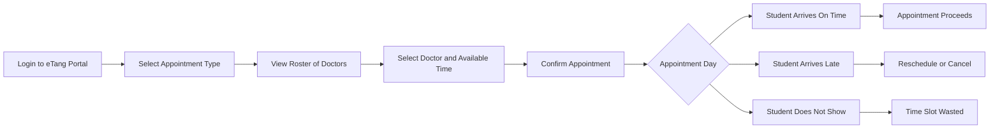
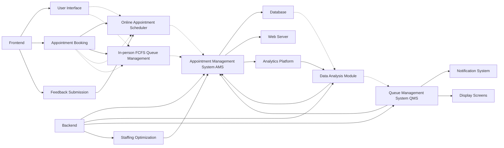

# Healthcare_analytics

| Scheduling Algorithm | Average Waiting Time | Average System Time |
|----------------------|----------------------|---------------------|
| FCFS                 | 7.53                 | 12.41               |
| SPT                  | 487.53               | 492.41              |
| EDD                  | 25.12                | 30.00               |
| Slack Time Remaining | 26.78                | 31.67               |
| Critical Ratio       | 67.36                | 72.24               |

This table summarizes the average waiting time and average system time for each scheduling algorithm.

---

If the focus is specifically on developing an online portal for scheduling appointments within a healthcare system, the budget allocation can be significantly streamlined. Below is a simplified budget table for this specific project, focusing on the essential costs associated with developing and implementing an online scheduling portal.

### Budget Allocation for Online Scheduling Portal

| Category                       | Description                                               | Estimated Cost (USD)   | Percentage of Total Budget |
|--------------------------------|-----------------------------------------------------------|------------------------|-----------------------------|
| **Software Development**       | Custom portal design and development                      | $100,000               | 50%                        |
| **Hardware Acquisition**       | Servers and infrastructure for hosting the portal         | $20,000                | 10%                        |
| **Software Licensing**         | Third-party software for integration (e.g., databases)    | $30,000                | 15%                        |
| **Testing and Quality Assurance** | Ensuring the portal runs smoothly on all devices       | $20,000                | 10%                        |
| **Training**                   | Training staff to use and manage the portal               | $10,000                | 5%                          |
| **Marketing and Communication** | Promoting the new portal to patients                      | $10,000                | 5%                          |
| **Contingency Fund**           | Reserved for unexpected expenses                          | $10,000                | 5%                          |
| **Total**                      |                                                           | **$200,000**           | 100%                       |

---

### Streamlined Operational Plan (6-Month Timeline)

| **Date/Milestone**       | **Task/Activity**                        | **Responsibility**        |
|--------------------------|-----------------------------------------|---------------------------|
| **May 2024**             | Project Kick-off & System Selection     | Project Manager, IT Manager|
| **June 2024**            | System Implementation & Staff Training  | IT Team, HR Manager       |
| **July 2024**            | Soft Launch & Marketing Campaign        | Operations Manager, Marketing Team |
| **August 2024**          | Full System Go-Live                     | Project Team              |
| **September 2024**       | Process Review & Customer Feedback      | Operations Manager, Customer Service Team |
| **October 2024**         | Analysis & Adjustment Phase             | All Departments           |

This operational plan compresses the essential tasks into a 6-month timeline, from system selection to final adjustments post-launch, ensuring rapid deployment and efficient use of resources. Each phase has been streamlined to focus on critical activities, aligning with strategic business goals and rapid execution.

---

