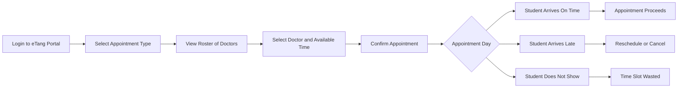
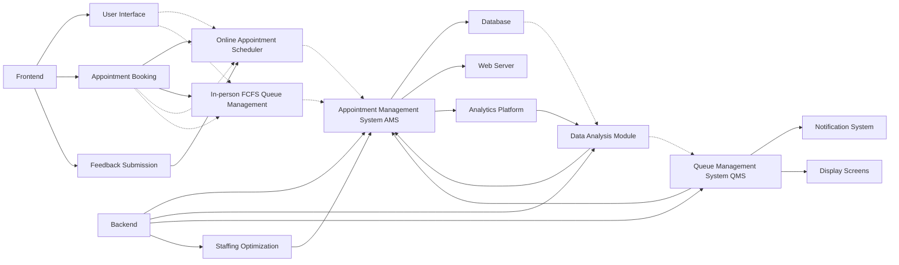

# Healthcare_analytics

# 🔆 Introduction

The healthcare services at UC Berkeley is undergoing a significant transformation with the integration of data analytics and technology. This project aims to leverage data analytics and optimization techniques to improve the efficiency and effectiveness of healthcare systems, specifically focusing on appointment scheduling and queue management within a healthcare facility.

# 🥳 Features

## Analysis and Methodology

1. Data Preparation: University Health Services (UHS) statistics originated from [fenghaolin/HanguData (github.com)](https://github.com/fenghaolin/HanguData)
2. Exploratory Data Analysis (EDA)
3. Feature Importance Analysis
4. Model Building
5. Queuing Simulation and Algorithms
6. System Architecture Design

This table summarizes the average waiting time and average system time for each scheduling algorithm.

| Scheduling Algorithm | Average Waiting Time | Average System Time |
|----------------------|----------------------|---------------------|
| FCFS                 | 7.53                 | 12.41               |
| SPT                  | 487.53               | 492.41              |
| EDD                  | 25.12                | 30.00               |
| Slack Time Remaining | 26.78                | 31.67               |
| Critical Ratio       | 67.36                | 72.24               |

## System Design

---

# 📝 Changelog
- [2024.04.15] Added initial project proposal
- [2024.04.20] Completed data collection and cleaning
- [2024.04.21] Conducted exploratory data analysis (EDA) and identified key insights
- [2024.04.26] Designed the online appointment scheduler system architecture
- [2024.04.28] Finalized the project details

---

# 📢 Disclaimer
This repository is for personal/research/non-commercial use only.

---
Copyright © University of California, Berkeley, Faculty of Engineering, Department of Industrial Engineering and Operation Research, [Hin Chi Kwok](https://github.com/HaleyKwok). All rights reserved.